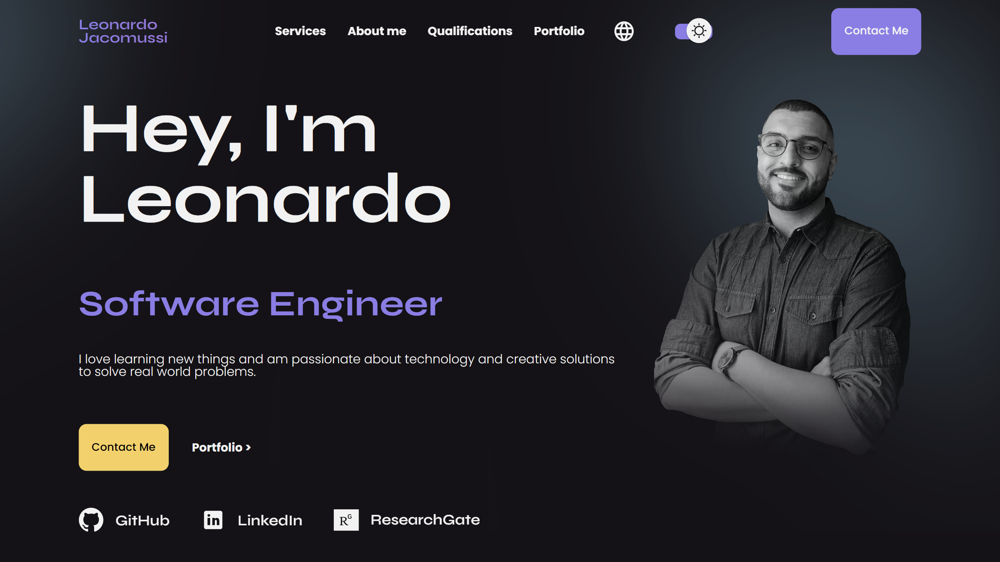

<h1 align="center">Personal site</h1>

<p align="center">
Welcome to my personal website repository. The purpose of the site is to share my professional profile telling a little about my experiences, knowledge and portfolio. Feel free to get inspired, and I'll be happy to get your feedback (you can do that in the <a href="https://www.leonardojacomussi.com/#contact" target="_blank">contact section</a> 🙂). <br/>
</p>

<p align="center">
  <a href="#live">Live</a>&nbsp;&nbsp;&nbsp;|&nbsp;&nbsp;&nbsp;
  <a href="#technologies">Technologies</a>&nbsp;&nbsp;&nbsp;|&nbsp;&nbsp;&nbsp;
  <a href="#layout">Layout</a>&nbsp;&nbsp;&nbsp;|&nbsp;&nbsp;&nbsp;
  <a href="#devEnv">Development environment</a>&nbsp;&nbsp;&nbsp;|&nbsp;&nbsp;&nbsp;
  <a href="#license">License</a>
</p>

<p align="center">
  
</p>

<br>

<p align="center">
  
</p>

<br/><br/>
<h2 id="live">👁️‍🗨️ Live</h2>

The `main` branch of this project is hosted by Vercel and available through the domain <a href="https://www.leonardojacomussi.com/" target="_blank">https://www.leonardojacomussi.com/</a>.

<br/><br/>
<h2 id="technologies">🚀 Technologies</h2>

This project was developed with the following technologies:

<p align="center">
    <table>
    <br><table>
    <tbody>
        <tr>
          <td align="center">
            
          </td>
          <td>React JS</td>
        </tr>
        <tr>
          <td align="center">
            
          </td>
          <td>Next JS</td>
        </tr>
        <tr>
          <td align="center">
            
          </td>
          <td>Typescript</td>
        </tr>
        <tr>
          <td align="center">
            
          </td>
          <td>Node JS</td>
        </tr>
        <tr>
          <td align="center">
            
          </td>
          <td>Emotion</td>
        </tr>
        <tr>
          <td align="center">
            
          </td>
          <td>Mui Material</td>
        </tr>
        <tr>
          <td align="center">
            
          </td>
          <td>SendGrid API</td>
        </tr>
        <tr>
          <td align="center">
            
          </td>
          <td>Google Maps Api</td>
        </tr>
        <tr>
          <td align="center">
            
          </td>
          <td>Git and Github</td>
        </tr>
        <tr>
          <td align="center">
            
          </td>
          <td>Figma</td>
        </tr>
    </tbody>
</table></p>

<br/><br/>
<h2 id="layout">🔖 Layout</h2>

You can view the project layout through [THIS LINK](https://www.figma.com/file/z3sDb7gBrcYhpmAvJXF503/leonardojacomussi.com?node-id=0%3A1&t=EbjaPsxkueSCnki3-1). You must have a [Figma](https://figma.com) account to access it.

<br/><br/>
<h2 id="devEnv">👨🏽‍💻 Development environment</h2>

This is a [Next.js](https://nextjs.org/) project bootstrapped with [`create-next-app`](https://github.com/vercel/next.js/tree/canary/packages/create-next-app).

- Getting Started

First, run the development server:

```bash
npm run dev
# or
yarn dev
# or
pnpm dev
```

Open [http://localhost:3000](http://localhost:3000) with your browser to see the result.

- Learn More

To learn more about Next.js, take a look at the following resources:

[Next.js Documentation](https://nextjs.org/docs) - learn about Next.js features and API.
[Learn Next.js](https://nextjs.org/learn) - an interactive Next.js tutorial.

- Environment variables

In the root folder of the project, create a `/.env.local` file with the following keys for the APIs to work (look for how to get your own keys):

```
NEXT_PUBLIC_GOOGLE_ANALYTICS_TAG=******
NEXT_PUBLIC_PERSONAL_EMAIL=******
NEXT_PUBLIC_SENDGRID_API_KEY=******
```

Replace `******` with your corresponding API keys.

<br/><br/>
<h2 id="license">📜 License</h2>

This project is under the MIT license.
